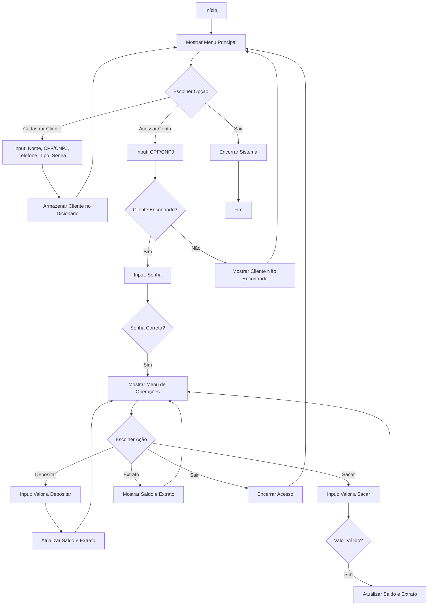

# 💳 Sistema Bancário em Python

> Este projeto tem como objetivo exercitar a lógica em Python, simulando a criação de um sistema bancário completo.

## 📜 Descrição
O **Sistema Bancário** é um projeto desenvolvido em Python que permite aos usuários:
- Cadastrar clientes com informações básicas.
- Acessar contas de forma segura.
- Realizar operações bancárias como depósitos e saques.
- Visualizar extratos detalhados.

Esse projeto é uma excelente oportunidade para praticar programação em Python e compreender conceitos de segurança e manipulação de dados.

## 🚀 Funcionalidades
- **Cadastro de Clientes**: 
  - Cadastrar clientes com nome, CPF/CNPJ, telefone e senha.
  
- **Acesso à Conta**: 
  - Os clientes podem acessar suas contas usando CPF/CNPJ e senha.

- **Operações Bancárias**:
  - 💵 **Depositar**: Adiciona valor à conta do cliente.
  - 💳 **Sacar**: Permite a retirada de valores da conta.
  - 📊 **Extrato**: Mostra o saldo atual e o histórico de transações.

## 📊 Diagrama Lógico


## 📦 Tecnologias Utilizadas
- **Python 3.x**: A linguagem de programação utilizada para desenvolver o sistema.
- **Dicionários**: Estruturas de dados que armazenam informações dos clientes.

## 🛠️ Como Executar
Para executar o sistema bancário, siga os passos abaixo:

1. **Baixe o Projeto**:
   - Use o botão de download ou clone o repositório.

2. **Navegue até o diretório do projeto**:
   ```bash
   cd PythonBank
   ```

3. **Execute o script**:
   ```bash
   python banking_system.py
   ```
