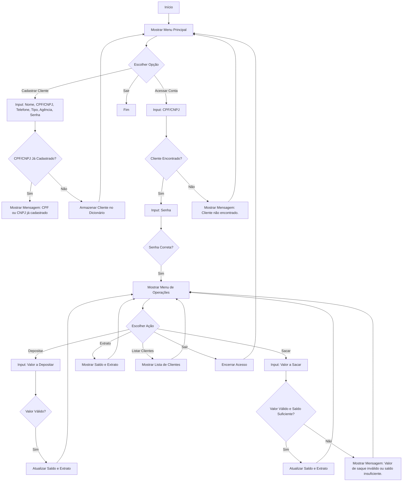

# 💳 Sistema Bancário com Uso de Estruturas de Dados em Python

> Este projeto tem como objetivo exercitar a lógica e os fundamentos referentes às estruturas de dados em Python, simulando a criação de um sistema bancário completo.

## 📜 Descrição
O **Sistema Bancário** é um projeto desenvolvido em Python que permite aos usuários:
- Cadastrar clientes com informações básicas.
- Acessar contas de forma segura.
- Realizar operações bancárias como depósitos, saques e consultas de extratos.
- Listar todos os clientes cadastrados.

Esse projeto é uma excelente oportunidade para praticar programação em Python e compreender conceitos de segurança e manipulação de dados, utilizando estruturas como dicionários, listas, tuplas e conjuntos.

## 🚀 Funcionalidades
- **Cadastro de Clientes**: Os usuários podem cadastrar clientes com nome, CPF/CNPJ, telefone, tipo de conta (Física ou Jurídica) e agência.
- **Acesso à Conta**: Os clientes podem acessar suas contas usando CPF/CNPJ e senha, com um limite de tentativas.
- **Operações Bancárias**:
  - 🏦 **Depositar**: Adiciona valor à conta do cliente.
  - 💰 **Sacar**: Permite a retirada de valores da conta, respeitando um limite de saques por sessão.
  - 📊 **Extrato**: Mostra o saldo atual e o histórico de transações.
  - 📋 **Listar Clientes**: Mostra uma lista de todos os clientes cadastrados.

## 📊 Diagrama Lógico


## 🛠️ Como Executar
Para executar o sistema bancário, siga os passos abaixo:

1. **Baixe o Projeto**:
   - Use o botão de download ou clone o repositório.

2. **Navegue até o diretório do projeto**:
   ```bash
   cd PythonBankEvolution
   ```

3. **Execute o script**:
   ```bash
   python banking_system_evolution.py
   ```
